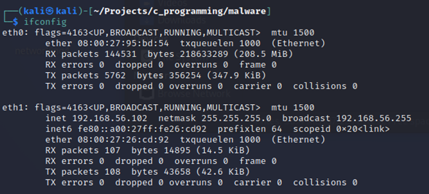

# C-Basic-RAT
 C Based Remote Access Tool

Video to follow
 
Build Undetectable Malware Using C Language Ethical Hacking on YouTube\n

https://www.youtube.com/watch?v=6Dc8i1NQhCM&t=2686s\n
Learned approach from the above video.

 
Get current IP Address from server box: 192.168.56.102
 
 
Server.c
 

 
Backdoor.c 

Make sure to update server and client programs

 
Then compile using the above commands on a Linux box.

 

Once compiled, transfer it over.
 
 
 

Run server and execute on windows client.  The user will receive window stating "Your Device has been hacked!!!"
Server will receive a shell with the client's Ip Address

 
Dir Command

Dir command

Previous path
 

Whoami command
 

 
Keylogger is executed on server side
 

The client opens up notepad by pressing the windows button and search for notepad. Once notepad is found, it is clicked and the user types "Hello World"
 

Once the user starts typing, it starts logging the keys pressed in a file called windows.txt in the directory it was executed.  In this case, it is the IEUser user directory.
 

If persist command is ran, it creates a regedit key to the run directory to auto run the program when windows boots up.

 
Connection is re-established after logging in.

 
When user inserts q, it will close connection
 

